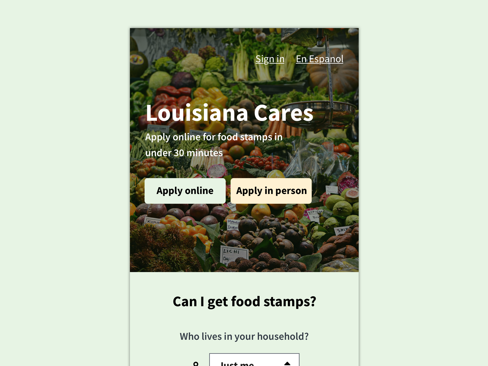
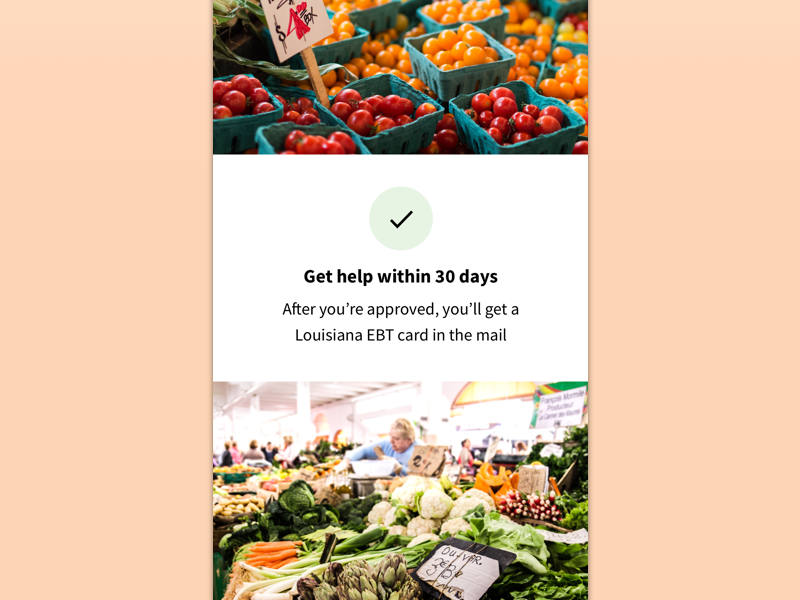
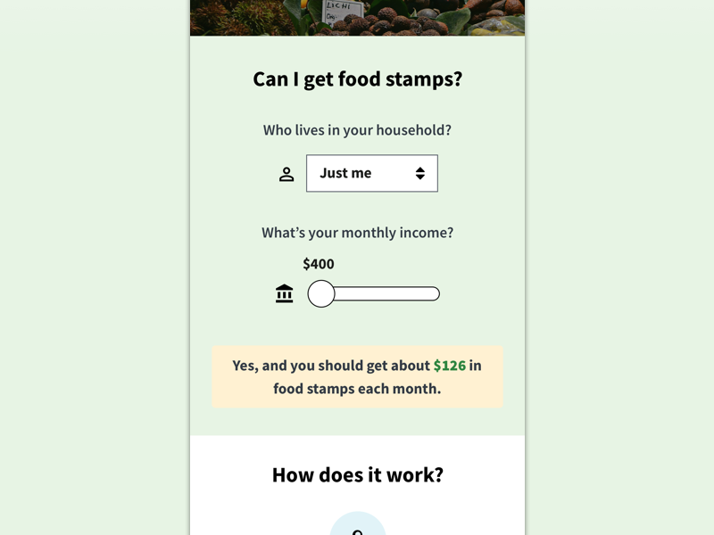

The Supplemental Nutrition Assistance Program (SNAP)--known to most people as food stamps--is a welfare assistance program available in Louisiana and administered by the United States Department of Agriculture. By providing monthly food assistance to eligible low-income individual, SNAP is integral to the livelihood and wellness of people in Louisiana and all of America. In the fiscal year 2011, SNAP provided assistance to nearly 45 million people—about one in seven Americans. [(USDA 2012)][usda]

However, it is difficult and time consuming for people to access and apply for welfare assistance in Louisiana—SNAP is no exception. Unwelcoming, dated websites frustrate people with accessibility and usability problems. Information on SNAP is unstructured and difficult to find, overwhelming people and creating anxiety when searching for assistance and learning about which programs to apply for. With phrases like "165% Maximum Income Limits", the eligibility criteria for SNAP are unclear for most people. SNAP application forms are redundant, difficult to access and poorly translated to languages other than English.

Many people describe the application process as throwing information into a black hole, left waiting for weeks, wondering about the status of their application. The experience for applicants is just not good and costs people—who are already impoverished enough—their time, energy and money.

## The Problem

These issues manifest in one number: 26.9 million children were eligible for SNAP (and Medicaid) in 2013, but did not receive assistance. (Wheaton et al. 2017) The parents of these children were not declined assistance. Instead, I believe they chose to forego enrollment in welfare programs because the journey to get assistance from those programs is too difficult and too time-consuming. 

> "[The process of applying for food stamps] very redundant. It just felt like I was filling out the same information over and over and over again." 
> <cite>[Chronister et al. 2016:6][chronister]</cite>

When people are busy applying for jobs, finding alternative sources of income and keeping their family together, I believe they simply can not afford the complex journey of applying for SNAP.

## Research Question

The research question of my design capstone project and honors thesis, “How can user-centered design improve the user experience of applying for SNAP in Louisiana?”, looks at how to improve this problem, creating a better experience for those who need it most.

## The Goal

The goal of the project is to demonstrate how Louisiana can improve the experience of applying for SNAP in Louisiana through design and design research. I hope this research can help product teams, policymakers and other stakeholders in government services design experiences that help people more  easily apply for SNAP. With a better application experience, assistance will reach the people that need it, improving their wellbeing and food security. Aside from providing a better way of life for people, SNAP generates a significant impact on the economy. For every five dollars spent on SNAP assistance, eight dollars is stimulated in the economy. [(Kirlin 2017)][kirklin]

## Literature Review

Within academia, the literature suggests expanding policy, spending more smartly and cutting red tape are opportunities to improve access to SNAP. In general, policy is important to improving access and usability because it dictates what must be accomplished by SNAP and influences the strategy of the touch points built by the program.

### Policy provides protections for people with disability
Better policy, such as extending Section 504 and Section 508 of the American Rehabilitation Act improve protection and increase website access for segments of the population with physical disabilities. [(Lyles et al. 2017)][lyles]

### Spend funds smarter
Smarter spending—with funds invested in research, design and technology—create more well designed products, improving the application process. [(Lower-Basch 2017)][lower-basch]

### People are challenged by access, literacy and fluency
The literature shows three primary variables challenge people who interact with the government: (1) digital access, (2) digital literacy and (3) English language fluency. The people challenged by these three variables depend on others—a family member, a close friend, the local librarian or some other proxy in their social network—for help. [(Chronister et al. 2017)][chronister] People rely on a proxies because websites and other services are not designed to provide ease-of-use or assistance. For the Louisiana SNAP website, all FAQ and Help buttons are broken, leading to an error page and no way to go back.

With regard to English language fluency, non-English speakers find government services incomplete or inaccurate, and, again, rely on proxies. [(Ibid.)][chronister]

The reliance on a proxy does, however, break down if a person’s social network is limited. They may not have a friend they can ask for help, or a library to visit. If a person’s network is limited, they fall through the cracks and forgo the application process.

### People make a cost-benefit analysis before applying for SNAP
The literature also shows people weigh the benefit of a government service with the effort—and time cost of—applying for it. If the cost is too high, then they forgo the application process and any the potential benefits. [(Ibid.)][chronister]

### Realtime feedback and speediness is important
Speed and real-time feedback is an important opportunity for improvement. Many people, especially the most vulnerable segments of the population, find their experience "slow" and "cumbersome". [(Gaudet 2017)][] Other people feel they are tossing paperwork into a black hole, waiting "endlessly" for a response from the government. [(Comeaux 2016:29)][] Additionally, when websites provide real-time feedback and eligibility, people will follow through with the application process.

## Design Process
My project follows a user-centered design process. The starts process with defining a "people problem", an issue people face in the world, and a selecting a topic. Then, literature on the topic (and related topics) is reviewed and summarized. The review includes academic articles as well as non-academic reports and articles from teams working on government services. After the literature review, the SNAP application process is audited for usability issues and modeled as a user journey. This informs artifacts like the the pain point list and usability guidelines. Finally, prototypes put the usability guidelines into action, demonstrating actual solutions to the pain points.

## User Journey
A user journey simply demonstrates the phases (steps) people go through as they interact with a product, service or other thing that exists now or will exist in the future. For SNAP, the user journey includes seven phases.

1. Phase 1: Major life event and change of income
2. Phase 2: Find options for help and assistance
3. Phase 3: Figure out how to apply for assistance
4. Phase 4: Submit applications online, via mail or in person
5. Phase 5: Interview with caseworker and await decision
6. Phase 6: If approved, receive assistance
7. Phase 7: If approved, renew to continue assistance

## Pain Points
A pain point is any moment when an interaction becomes unpleasant, inefficient or otherwise unsatisfactory. When applying for SNAP, applicants experience many pain points along their journey, but for my project, I focused on three; I would argue these three are the most critical in the journey, giving people significant headache and trouble.

### Finding information
Before starting the application, people are easily overwhelmed when gathering information about food assistance programs. The official SNAP website is difficult to find, leaving people to get information from multiple unofficial sources. The website also contains 2500 words and no images or graphics; that is roughly 5 pages of text. With unclear, complicated phrases like “165% Maximum Income Limits”, language on SNAP is difficult and overwhelming for people to comprehend. To improve this pain point, content should be written in plain language and easily available on a distinct landing page.

### Determining eligibility
Again, before starting the application, people analyze if the required time to apply is worth the assistance they receive. Eligibility tools show people if they are eligible before they apply. The state, however, does not provide a tool for people to quickly determine if they are eligible for SNAP assistance. A federal tool to determine eligibility for SNAP does exist, but is dated, does not work on small screens and does not work in modern web browsers. To improve this pain point, people should be able to quickly determine their eligibility before starting an SNAP application.

### Answering questions
When working on the application,  people are overwhelmed by the large number of questions in the SNAP application and the effort it takes to complete each section of the application. For a single individual, there are over 125 questions. For each additional person on the application, there is an additional 25 questions.

There is no affordance for people to control the order they answer each question on the application and they are required to work from start to finish, instead of working in the order they like. Additionally, there is no way for people to see their overall progress on the application in terms of time and percentage. People should be able to see the remaining percentage of the application and the estimated time it will take to finish. To improve this pain point, people should see their overall progress, time remaining and be able to switch between sections of the application.

## Usability Guidelines
The fourth artifact designed for the project is a list of usability guidelines. An usability guideline is a heuristic that can be used to inform and guide usability and accessibility decisions made by designers. When designing for SNAP applicants, design teams should follow these guidelines.

### Design responsive layouts for websites
Websites should respond and adapt to different screen sizes, ranging from the smallest Android phone to the largest desktop monitor. This ensures websites will reach all segments of the population.

### Design mobile first layouts for websites
Most people who apply for SNAP will apply on a mobile device with a small screen. Optimize websites for mobile devices by first designing for small screens, then designing for large screens. This ensures applicants have a better user experience, instead of being an after-thought.

### Design with the U.S. Web Design System
Websites should follow the guidelines of and use components from the U.S. Web Design System (USWDS), an official, standardized system for designing government websites. With a system like USWDS, people more easily understand common patterns like colors, buttons and forms. The less people have to think about meaning of each component in the system, the easier the system is to use.

### Simplify content structure

Without structure and hierarchy, content becomes overwhelming for people to understand. Avoid walls of written text with no images, illustrations or icons. Separate written content into chunks with headers and visuals.

### Write content in plain language
Writing content in clear, plain language helps people easily understand information about SNAP and mitigates anxious or otherwise apprehensive feelings they might have about the program. With plain language, more people will understand the eligibility requirements for SNAP, the application for SNAP and other important information.

### Provide realtime feedback

Providing realtime eligibility feedback to people mitigates any cost-benefit analysis they might make before starting or during the application process. If, before starting, people know how much time is required of them and how likely they are to receive assistance, they are more likely to start the application. Additionally, if, after starting, people know how much time remains on the application and they can see their overall progress on the application, they are more likely to finish the application and less likely to discard their progress.

### Provide multiple channels
Providing multiple channels for people to apply through-—be it via a website, 1-800 number, SNAP office or U.S. mail-—means SNAP will reach more segments of the population. Many people will prefer to apply online, but some will prefer other channels. This is especially important for older segments of the population, who have lower digital literacy, and for extremely impoverished segments, who have lower digital access.

### Provide quality translations of content
Providing quality translations of content means SNAP will reach segments of the population who are not fluent in English. Not all people who apply for SNAP will speak English and, in order for them to complete the application, will need alternate translations of content.

### Afford user control over the application
Affording user control over the application means people can chose which sections of the application they work on first. If people prefer to work on a certain section of the application first—because they have what they need for that section—they should be able to do so.

## Conclusion
In conclusion, this project focuses how how better design can improve the user experience of applying for SNAP by decreasing the time and effort it takes for someone to apply. My research question, “How can user-centered design improve the user experience of applying for SNAP in Louisiana?”, looks at how to improve this problem. The project goal--realized through the artifacts I described--is to demonstrate to designers, policymakers and other stakeholders in SNAP how better design can create a better experience for those who need it most.

## Sources
[chronister]: #citation-chronister
[comeaux]: #citation-comeaux
[gaudet]: #citation-gaudet
[kirlin]: #citation-kirklin
[lower-basch]: #citation-lower-basch
[lyles]: #citation-lyles
[usda]: #citation-usda
[wheaton]: #citation-wheaton

Chronister, Michelle, Carolyn Dew, Colin MacArthur, Brad Nunnally, and John Yuda. 2016. ["Expectations and Challenges: Informing the Future of the Federal Front Door."](https://labs.usa.gov/) General Services Administration. Retrieved October 23, 2017.

Comeaux, Nicole. 2016. <i>[Mapping the applicant experience of benefit enrollment.](https://usds.github.io/benefits-enrollment-prototype/assets/discovery-findings-mapping-enrollment-Nov2016.pdf)</i> Washington, DC: U.S. Digital Services. Executive Office of the U.S. President. Retrieved November 11, 2016.

Gaudet, Genevieve. 2017. <i>[Simplifying the social safety net.](https://blog.navapbc.com/simplifying-the-social-safety-net-ad0e99815ed0)</i> Washington DC: Nava PBC. Retrieved November 6, 2017.

Kirlin, John A. 2017. <i>[Supplemental Nutrition Assistance Program (SNAP) Linkages with the General Economy.](https://www.ers.usda.gov/topics/food-nutrition-assistance/supplemental-nutrition-assistance-program-snap/economic-linkages/)</i> Washington DC: U.S. Department of Agriculture. Retrieved December 4, 2017.

Lower-Basch, Elizabeth. 2017. "Improving Access, Cutting Red Tape." Policy & Practice 72(2): 20-29.

Lyles, Courtney, Jim Fruchterman, Mara Youdelman, and Dean Schillinger. 2017. "Legal, Practical, and Ethical Considerations for Making Online Patient Portals Accessible for All." American Journal of Public Health 107(10): 1608-1611.

United States Department of Agriculture. 2012. <i>Building a Healthy America: A Profile of the Supplemental Nutrition Assistance Program.</i> Alexandria, VA: Food and Nutrition Service Office of Research and Analysis.

Wheaton, Laura, Victoria Lynch, and Martha C. Johnson. 2017. ["The Overlap in SNAP and Medicaid/CHIP Eligibility, 2013: Findings from the Work Support Strategies Evaluation."](https://www.urban.org/research/publication/overlap-snap-and-medicaidchip-eligibility-2013) Urban Institute. Retrieved November 11, 2017.

